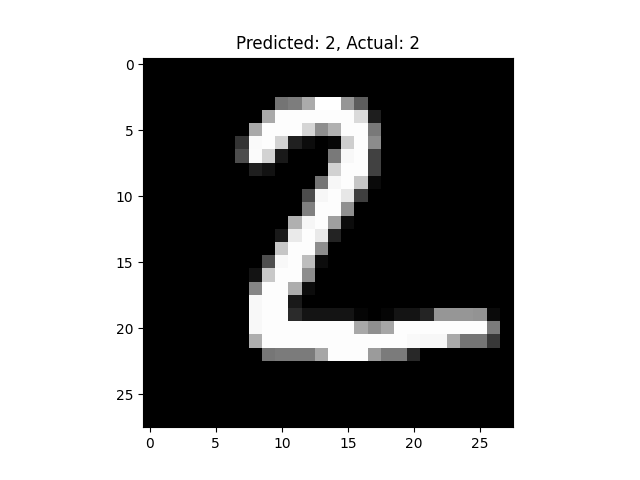
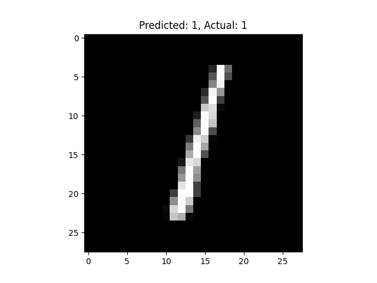

# Handwritten Digit Recognizer
This project uses a Convolutional Neural Network (CNN) to recognize handwritten digits (0-9) from the MNIST dataset. Built with TensorFlow.

## Features
- Achieves ~98% accuracy on test data.
- Includes data preprocessing, model training, and visualization.
- Saved model included for reuse.

## How to Run
1. Install dependencies: `pip install tensorflow matplotlib numpy`
2. Run the script: `python digit_recognizer.py`

## Results
Below are some example predictions:

## Files
- `digit_recognizer.py`: Main script.
- `mnist_digit_recognizer.h5`: Trained model.
